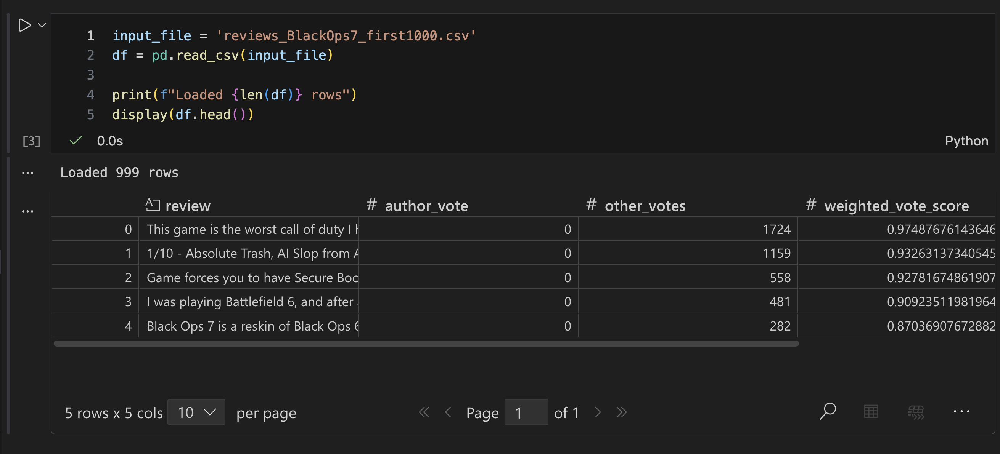
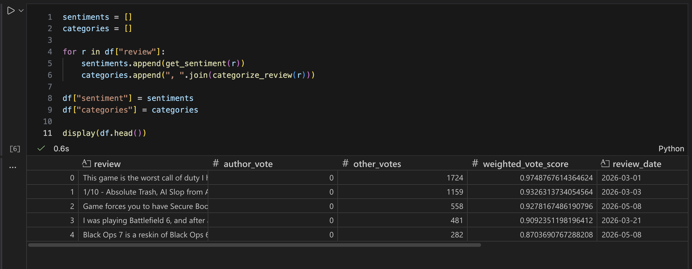
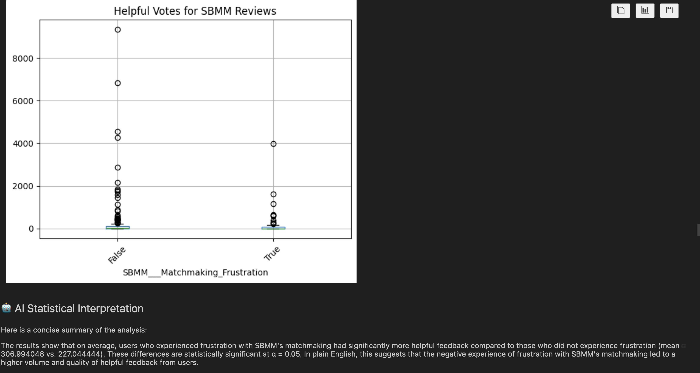
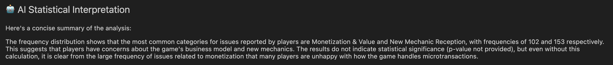
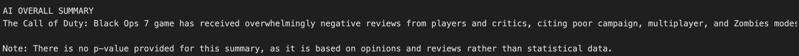

# Steam Review Research and Insights Tool User Guide

## Overview

The Steam Review Research and Insights Tool is designed to help User Research and Insights teams analyze large volumes of Steam player reviews. The application collects Steam reviews using the Steam Reviews API, categorizes player feedback into gameplay themes, performs statistical analyses, generates visualizations, and uses AI-generated summaries to identify key player opinions and trends.

This tool is meant to be used by User Research teams to quickly identify player feedback trends from Steam reviews through automated categorization, statistical analysis, and visualizations through AI summaries. 

The project is divided into two components:

- **steam_scraper.py** – Downloads Steam reviews and exports them to a CSV file.
- **review_analysis.ipynb** – Loads the CSV file, categorizes reviews, performs statistical analyses, generates visualizations, and creates AI-generated summaries.

---

## Quick Start

1. Clone or download this repository.
2. Install Python 3.13.11.
3. Install the required Python packages.
4. (Optional) Install Ollama to enable AI-generated summaries.
5. Run **steam_scraper.py** to collect Steam reviews.
6. Open **review_analysis.ipynb**.
7. Run all notebook cells from top to bottom.
8. Review the generated charts, statistical analyses, AI summaries, and Executive Summary.

---

## Requirements

This project was developed using:

- Python 3.13.11
- Jupyter Notebook
- Ollama (optional, for AI summaries)

Required Python packages:

- pandas
- numpy
- matplotlib
- scipy
- statsmodels
- textblob
- requests
- ollama

Install the required packages using:

```bash
pip install -r requirements.txt
```

---

## Optional: Install Ollama for AI Summaries

AI-generated summaries require Ollama.

1. Install Ollama.
2. Start the Ollama server.
3. Download the required model by running:

```bash
ollama pull llama3.2
```

If Ollama is not installed, the notebook will still complete all statistical analyses and visualizations, but AI summaries will not be generated.

---

## Using the Steam Review Scraper

Open **steam_scraper.py**.

Update the Steam App ID if you would like to analyze a different game.

Example:

```python
appid = 3606480
```

Run the scraper.

The scraper will:

- Connect to the Steam Reviews API
- Download Steam reviews
- Clean review text
- Remove short reviews
- Save the processed data as a CSV file



---

## Running the Analysis Notebook

Open **review_analysis.ipynb**.

Update the CSV filename if necessary.

Run every notebook cell from top to bottom.

The notebook will automatically:

- Load the review data
- Categorize reviews into gameplay themes
- Calculate sentiment scores
- Calculate review statistics
- Generate visualizations
- Perform statistical analyses
- Generate AI summaries (if Ollama is installed)
- Produce an Executive Summary


---

## Output

After the notebook has completed, the following analyses will be generated:

- Category Frequency Distribution
- Histograms
- Boxplots
- Correlation Analysis
- Statistical Tests
- AI-generated summaries
- Executive Summary





◊



---

## Troubleshooting

### ModuleNotFoundError

One or more required Python packages are missing.

Install the missing package using:

```bash
pip install package_name
```

---

### model llama3.2 not found

The required Ollama model has not been downloaded.

Run:

```bash
ollama pull llama3.2
```

---

### Ollama is not running

Start the Ollama application before running the notebook.

---

### FileNotFoundError

Verify that the CSV generated by **steam_scraper.py** exists and that the filename matches the filename specified in the notebook.

---

## Current Limitations

Current limitations of Version 1 include:

- Review categorization is keyword-based and may not identify every gameplay topic.
- AI summaries require Ollama to be installed and running locally.
- The project currently analyzes one Steam game at a time.
- Some gameplay terminology may require future updates to the keyword categories.

---

## Future Improvements

Potential future enhancements include:

- Support for analyzing multiple games simultaneously.
- Interactive web interface using Flask or Streamlit.
- Improved AI-powered topic detection.
- Exporting reports to PDF or Excel.
- Interactive filtering of reviews by category, sentiment, or helpful votes.

---

## License

This project is licensed under the MIT License.
